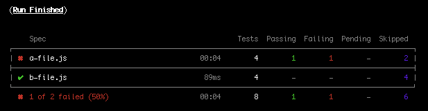

[![Build status][build-image]][build-url] [![Coverage Status][coveralls-image]][coveralls-url] [![Quality Gate][quality-gate-image]][quality-gate-url] [](https://dashboard.stryker-mutator.io/reports/github.com/javierbrea/cypress-fail-fast/main)

[](https://renovatebot.com) [![Last commit][last-commit-image]][last-commit-url] [![Last release][release-image]][release-url]

[![NPM downloads][npm-downloads-image]][npm-downloads-url] [![License][license-image]][license-url]

# Cypress Fail Fast

Enables fail fast in Cypress, skipping the rest of tests on first failure.

It can be configured to skip all remaining tests in current spec file, in current run, or even in parallel runs.

## Table of Contents

- [Installation](#installation)
- [Limitations and notes](#limitations-and-notes)
- [Configuration](#configuration)
  * [Environment variables](#environment-variables)
  * [Configuration by test](#configuration-by-test)
  * [Configuration examples for usual scenarios](#configuration-examples-for-usual-scenarios)
  * [Configuration for parallel runs](#configuration-for-parallel-runs)
- [Usage with TypeScript](#usage-with-typescript)

## Installation

Add the plugin to `devDependencies`

```bash
npm i --save-dev cypress-fail-fast
```

Now, depending on your Cypress version, use one of the next methods:

### Installation on Cypress 10

Inside `cypress.config.js` file:

```javascript
module.exports = {
  e2e: {
    setupNodeEvents(on, config) {
      require("cypress-fail-fast/plugin")(on, config);
      return config;
    },
    specPattern: "cypress/integration/**/*.js",
  },
};
```

Note: This example shows how to install the plugin for `e2e` testing type. Read [Cypress configuration docs](https://docs.cypress.io/guides/references/configuration) for further info.

At the top of your support file (usually `cypress/support/e2e.js` for `e2e` testing type)

```javascript
import "cypress-fail-fast";
```

### Installation on Cypress versions lower than 10

Inside `cypress/plugins/index.js`:

```javascript
module.exports = (on, config) => {
  require("cypress-fail-fast/plugin")(on, config);
  return config;
};
```

At the top of `cypress/support/index.js`:

```javascript
import "cypress-fail-fast";
```

From now, if one test fail after its last retry, the rest of tests will be skipped:



## Limitations and notes

* All spec files will be loaded, even after entering "skip mode", but every tests and hooks inside them will be skipped.
* The `spec` strategy does not work in headed mode, because for Cypress events it is like running a single spec, so all remaining tests will be skipped.

## Configuration

### Environment variables

* __`FAIL_FAST_STRATEGY`__: `'spec'|'run'|'parallel'`
  * If `spec`, only remaining tests in current spec file are skipped. This mode only works in "headless" mode.
  * If `run`, all remaining tests in all spec files are skipped (default value).
  * Use `parallel` to [provide your own callbacks](#configuration-for-parallel-runs) allowing to notify from one run to the others when remaining tests should be skipped.
* __`FAIL_FAST_ENABLED`__: `boolean = true` Allows disabling the "fail-fast" feature globally, but it could be still enabled for specific tests or describes using [configuration by test](#configuration-by-test).
* __`FAIL_FAST_PLUGIN`__: `boolean = true` If `false`, it disables the "fail-fast" feature totally, ignoring even plugin [configurations by test](#configuration-by-test).
* __`FAIL_FAST_BAIL`__: `Number = 1` Enable the skip mode immediately upon n number of failing test suite. Defaults to 1.

#### Examples

```bash
CYPRESS_FAIL_FAST_PLUGIN=false npm run cypress
```

or set the "env" key in the `cypress.json` configuration file:

```json
{
  "env":
  {
    "FAIL_FAST_STRATEGY": "run",
    "FAIL_FAST_ENABLED": true,
    "FAIL_FAST_BAIL": 2,
  }
}
```

### Configuration by test

If you want to configure the plugin on a specific test, you can set this by using the `failFast` property in [test configuration](https://docs.cypress.io/guides/core-concepts/writing-and-organizing-tests.html#Test-Configuration). The plugin allows next config values:

* __`failFast`__: Configuration for the plugin, containing any of next properties:
  * __`enabled`__ : Indicates wheter a failure of the current test or children tests _(if configuration is [applied to a suite](https://docs.cypress.io/guides/core-concepts/writing-and-organizing-tests.html#Suite-configuration))_ should produce to skip the rest of tests or not. Note that the value defined in this property has priority over the value of the environment variable `CYPRESS_FAIL_FAST_ENABLED` _(but not over `CYPRESS_FAIL_FAST_PLUGIN`, which disables the plugin totally)_.

#### Example

In the next example, tests are configured to "fail-fast" only in case the test with the "sanity test" description fails. If any of the other tests fails, "fail-fast" will not be applied.

```js
describe("All tests", {
  failFast: {
    enabled: false, // Children tests and describes will inherit this configuration
  },
}, () => {
  it("sanity test", {
    failFast: {
      enabled: true, // Overwrite configuration defined in parents
    },
  }, () => {
    // Will skip the rest of tests if this one fails
    expect(true).to.be.true;
  });

  it("second test",() => {
    // Will continue executing tests if this one fails
    expect(true).to.be.true;
  });
});
```

### Configuration examples for usual scenarios

##### You want to disable "fail-fast" in all specs except one:

Set the `FAIL_FAST_ENABLED` key in the `cypress.json` configuration file:

```json
{
  "env":
  {
    "FAIL_FAST_ENABLED": false
  }
}
```

Enable "fail-fast" in those specs you want using [configurations by test](#configuration-by-test):

```js
describe("All tests", { failFast: { enabled: true } }, () => {
  // If any test in this describe fails, the rest of tests and specs will be skipped
});
```

##### You want to totally disable "fail-fast" in your local environment:

Set the `FAIL_FAST_PLUGIN` key in your local `cypress.env.json` configuration file:

```json
{
  "env":
  {
    "FAIL_FAST_PLUGIN": false
  }
}
```

### Configuration for parallel runs

The plugin configuration supports defining two callbacks that, used in combination, allow to skip tests in one run when other run starts skipping tests also. Where, or how do you store the "flag" that allows to communicate your runs is in your hands, the plugin does not care about it.

To implement it, the plugin can receive an object with extra configuration as third argument when it is registered in the `cypress/plugins/index.js` file:

* __`parallelCallbacks`__: Object containing next properties:
  * __`onCancel`__: `function()` This callback is executed on first test failure that produces the plugin starts skipping tests.
  * __`isCancelled`__: `function(): boolean` If this callback returns `true`, the plugin skips remaining tests.

These callbacks are executed only when the environment variable `FAIL_FAST_STRATEGY` is set to `parallel`.

Here is an example of configuration that would skip tests on many parallel runs when one of them starts skipping tests. It would only work if all parallel runs have access to the folder where the `isCancelled` flag is being stored as a file (easy to achieve if all of your parallel runs are being executed on Docker images on a same machine, for example). _Note that this is only an example, you could also implement it storing the flag in a REST API, etc._

```js
// Example valid for Cypress versions lower than 10. Use config file on Cypress 10

const fs = require("fs");
const path = require("path");

// Flag file is stored in the /cypress folder
const isCancelledFlagFile = path.resolve(__dirname, "..", ".run-is-cancelled");

module.exports = (on, config) => {
  require("cypress-fail-fast/plugin")(on, config, {
    parallelCallbacks: {
      onCancel: () => {
        // Create flag file when the plugin starts skipping tests
        fs.writeFileSync(isCancelledFlagFile, "");
      },
      isCancelled: () => {
        // If any other run has created the file, start skipping tests
        return fs.existsSync(isCancelledFlagFile);
      },
    },
  });

  return config;
};
```

Note that this example requires to remove the created file when all of the runs have finished, or tests will always be skipped whenever any run starts again. So, the `FAIL_FAST_STRATEGY` environment variable should be set to `parallel` only in CI pipelines where the workspace is cleaned on finish, for example. 

## Usage with TypeScript

If you are using [TypeScript in the Cypress plugins file][cypress-typescript], this plugin includes TypeScript declarations and can be imported like the following:

```ts
import cypressFailFast = require("cypress-fail-fast/plugin");

export default (on: Cypress.PluginEvents, config: Cypress.PluginConfigOptions): Cypress.PluginConfigOptions => {
  cypressFailFast(on, config);
  return config;
};
```

Note: The example above is only valid for Cypress versions lower than 10. Use the configuration file in Cypress 10.

## Tests

To ensure the plugin stability, the current major version is being tested with Cypress major versions 9.x, 10.x, 11.x, 12.x and 13.x, and new releases will be published for each new Cypress minor or major releases, updating the E2E tests.

Minor versions used in the E2E tests can be checked in the `devDependencies` of the `package.json` files of the E2E tests:
* [Cypress v9.x](https://github.com/javierbrea/cypress-fail-fast/blob/main/test-e2e/cypress-variants/cypress-9/package.json)
* [Cypress v10.x](https://github.com/javierbrea/cypress-fail-fast/blob/main/test-e2e/cypress-variants/cypress-10/package.json)
* [Cypress v11.x](https://github.com/javierbrea/cypress-fail-fast/blob/main/test-e2e/cypress-variants/cypress-11/package.json)
* [Cypress v12.x](https://github.com/javierbrea/cypress-fail-fast/blob/main/test-e2e/cypress-variants/cypress-12/package.json)
* [Cypress v13.x](https://github.com/javierbrea/cypress-fail-fast/blob/main/test-e2e/cypress-variants/cypress-13/package.json)

Even when current major version may work with previous Cypress versions, it is not currently tested, so, to be sure it works you should use:

* Cypress 8.x may work, but it was tested until `cypress-fail-fast` 7.0.x
* If you need Cypress 7 support, use `cypress-fail-fast` 6.x
* If you need Cypress 6 support, use `cypress-fail-fast` 5.x
* If you need Cypress 5 or lower, use `cypress-fail-fast` <= 4.x

If you find any issue for a specific Cypress version, please report it at https://github.com/javierbrea/cypress-fail-fast/issues.

## Acknowledgements

This plugin has been developed based on the solutions proposed by the community on this [Cypress issue](https://github.com/cypress-io/cypress/issues/518), so thanks to all! I hope this plugin can be deprecated soon, as soon as the Cypress team adds native support for this feature. 😃

## Contributing

Contributors are welcome.
Please read the [contributing guidelines](.github/CONTRIBUTING.md) and [code of conduct](.github/CODE_OF_CONDUCT.md).

## License

MIT, see [LICENSE](./LICENSE) for details.

[coveralls-image]: https://coveralls.io/repos/github/javierbrea/cypress-fail-fast/badge.svg
[coveralls-url]: https://coveralls.io/github/javierbrea/cypress-fail-fast
[build-image]: https://github.com/javierbrea/cypress-fail-fast/workflows/build/badge.svg?branch=main
[build-url]: https://github.com/javierbrea/cypress-fail-fast/actions?query=workflow%3Abuild+branch%3Amain
[last-commit-image]: https://img.shields.io/github/last-commit/javierbrea/cypress-fail-fast.svg
[last-commit-url]: https://github.com/javierbrea/cypress-fail-fast/commits
[license-image]: https://img.shields.io/npm/l/cypress-fail-fast.svg
[license-url]: https://github.com/javierbrea/cypress-fail-fast/blob/main/LICENSE
[npm-downloads-image]: https://img.shields.io/npm/dm/cypress-fail-fast.svg
[npm-downloads-url]: https://www.npmjs.com/package/cypress-fail-fast
[quality-gate-image]: https://sonarcloud.io/api/project_badges/measure?project=javierbrea_cypress-fail-fast&metric=alert_status
[quality-gate-url]: https://sonarcloud.io/dashboard?id=javierbrea_cypress-fail-fast
[release-image]: https://img.shields.io/github/release-date/javierbrea/cypress-fail-fast.svg
[release-url]: https://github.com/javierbrea/cypress-fail-fast/releases

[cypress-typescript]: https://docs.cypress.io/guides/tooling/typescript-support.html
